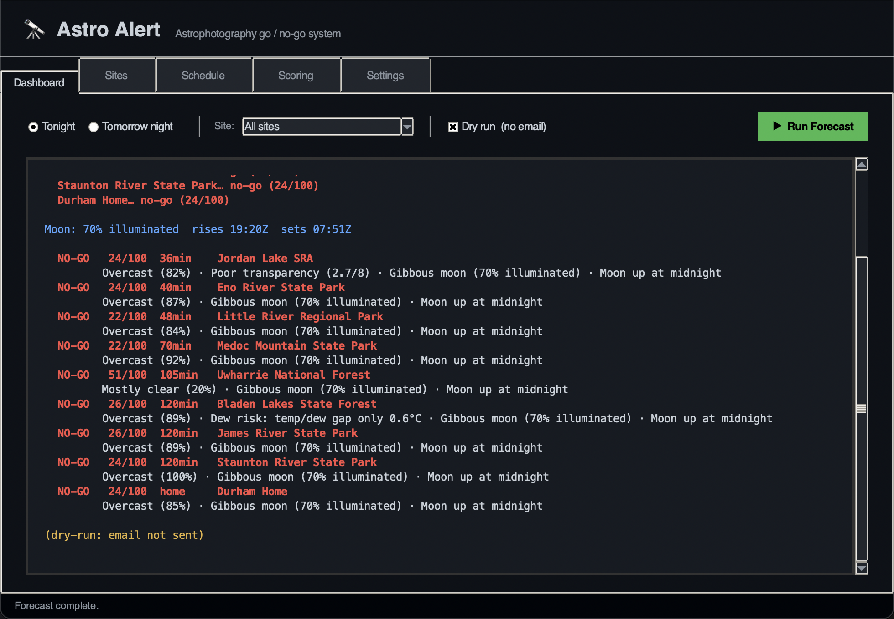
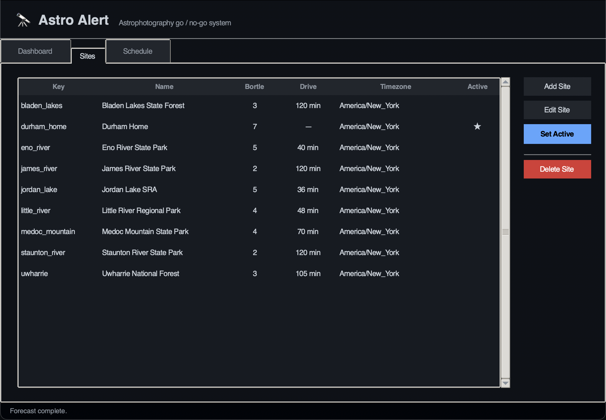
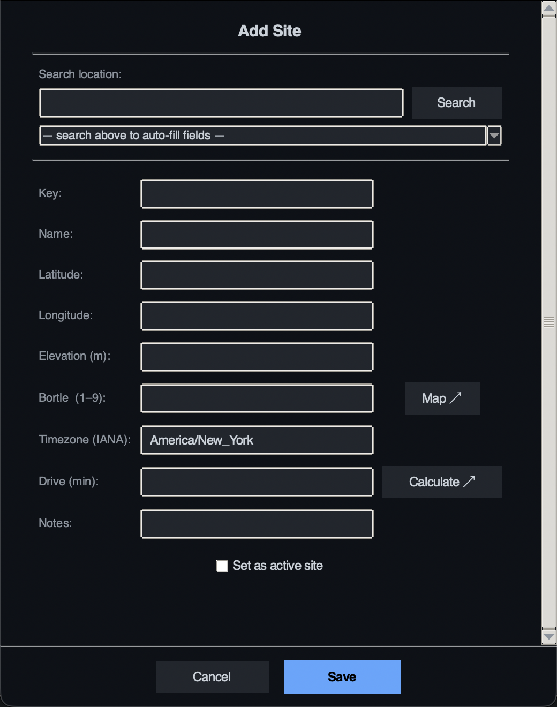
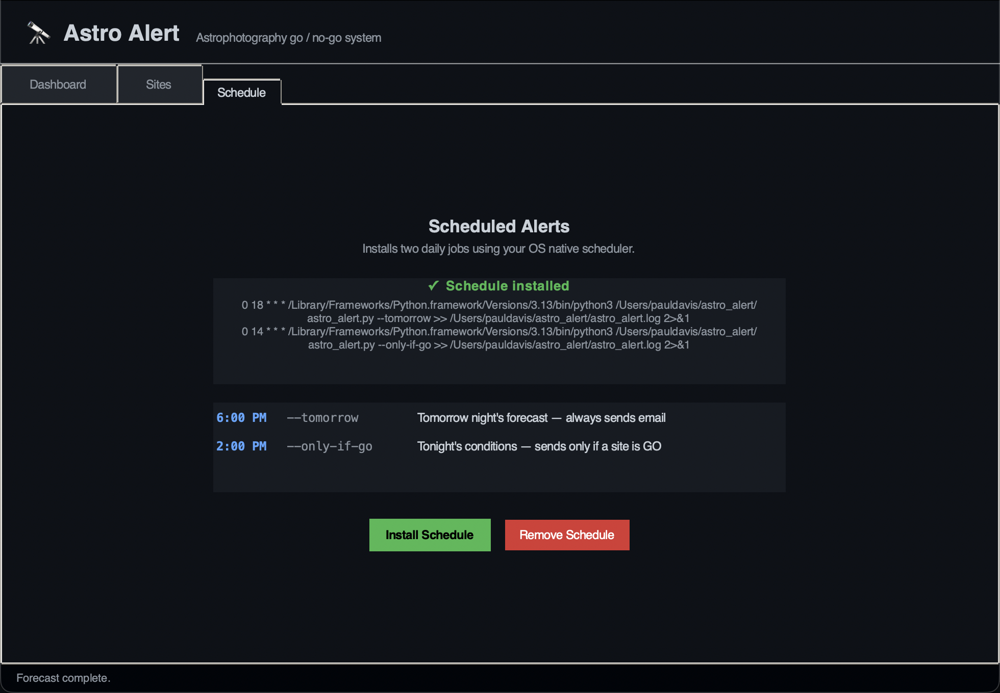
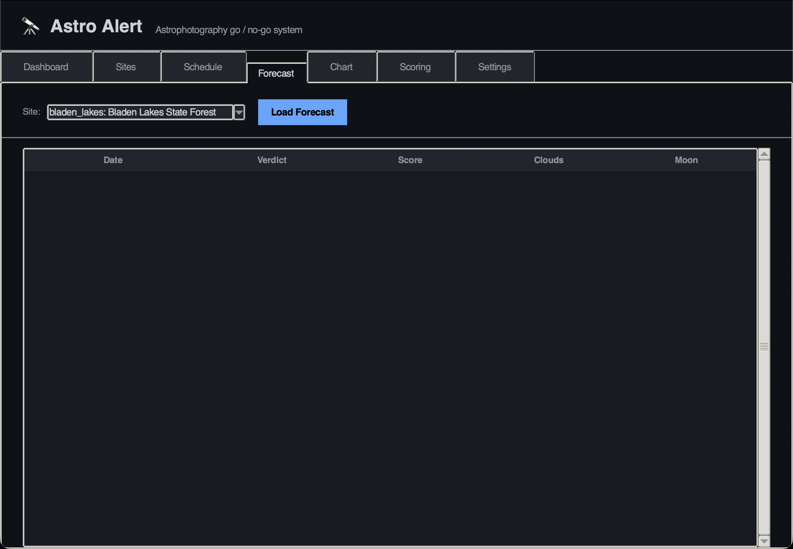
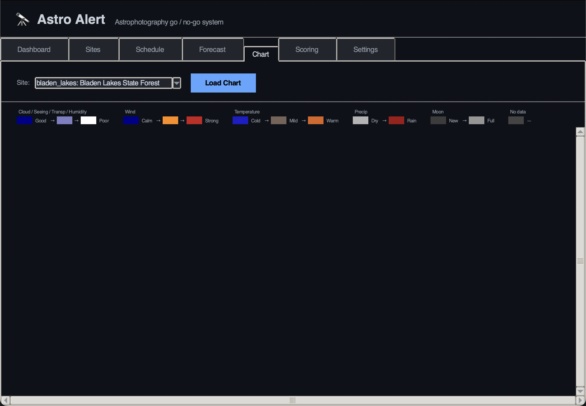
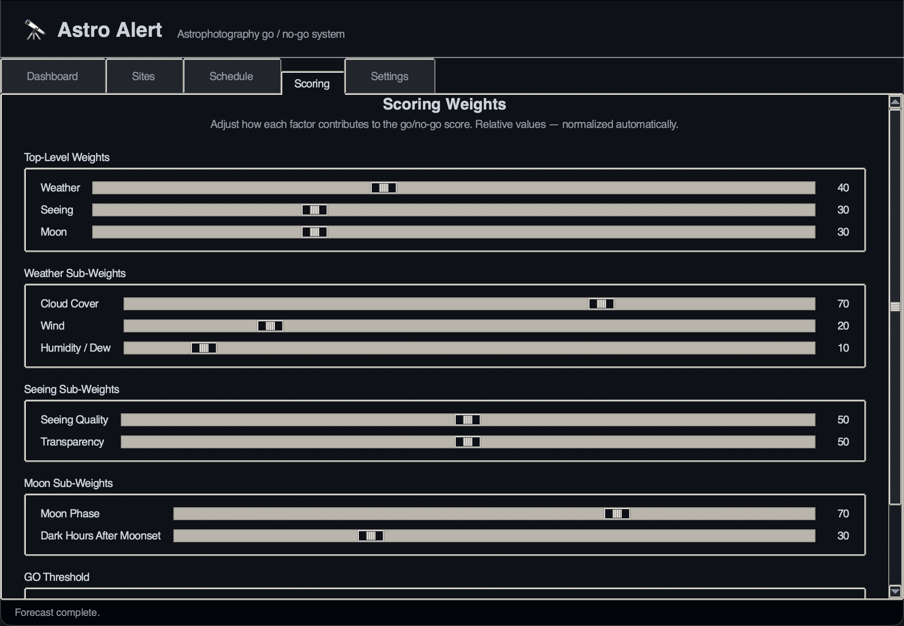
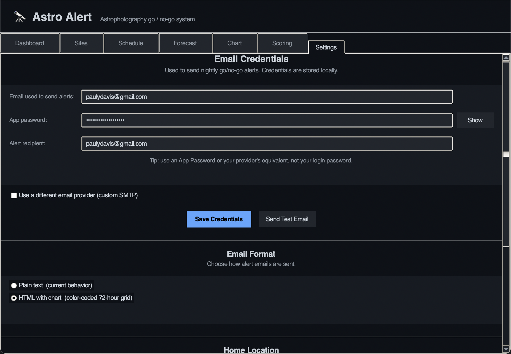
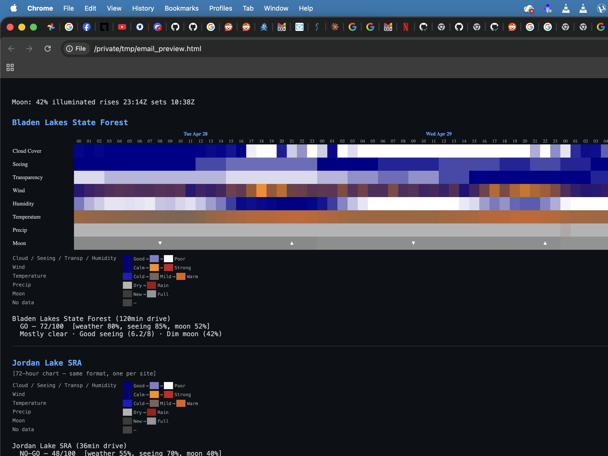

# Astro Alert

Go/no-go email alert system for astrophotography sessions. Fetches weather, atmospheric seeing, and moon data for your dark-sky sites, scores each one 0–100, and sends a nightly summary to your inbox — so you know whether it's worth heading out before it gets dark.

## GUI

Astro Alert has a graphical control panel with seven tabs:

**Dashboard** — run a dry-run or live forecast for any site, with colour-coded GO/NO-GO output.



**Sites** — add, edit, delete, and activate sites. The Add Site dialog geocodes a place name to fill coordinates automatically, fetches elevation from Open-Meteo, and links to lightpollutionmap.info for Bortle lookup.





**Schedule** — set up the two automatic daily emails with one click. Astro Alert runs itself in the background every day — no need to remember to open it.



**Forecast** — 14-night outlook for any site. Each night shows a GO/NO-GO verdict, total score, average cloud cover, and moon illumination. Click a row to expand a detail panel with the full breakdown and seeing notes.



**Chart** — 72-hour colour-coded heatmap of cloud cover, seeing, transparency, wind, humidity, temperature, precipitation, and moon phase — one column per hour, scrollable. Hover any cell for the exact value. A colour legend explains the scale for each row.



**Scoring** — adjust how much each factor (weather, seeing, moon) contributes to the go/no-go score. Sliders for all top-level and sub-weights; changes persist across sessions and are picked up by the next forecast run.



**Settings** — enter your Gmail address and App Password. Also set your **Home Location** (address search with autocomplete) — this becomes the starting point for automatic drive-time calculations. Credentials and home location are saved to your OS user data directory (never next to the source files).



## Installation (no Python required)

Download the latest release for your platform from the [Releases page](https://github.com/paulydavis/astro-alert/releases), or build it yourself from source (see below). No Python installation needed.

### Building from source

#### macOS → `AstroAlert.app`

```bash
bash build.sh
# Output: dist/AstroAlert.app
cp -r dist/AstroAlert.app /Applications/
```

Double-click **AstroAlert** in your Applications folder. On first launch macOS Gatekeeper will block it because it isn't signed. Right-click the app → **Open** → **Open** to allow it once. After that it opens normally.

#### Windows → `AstroAlert.exe`

Double-click **`build.bat`** (or run it from a command prompt that has Python on its PATH).

```
Output: dist\AstroAlert.exe
```

Copy `AstroAlert.exe` anywhere you like and double-click it. Windows SmartScreen will warn about an unsigned app — click **More info** → **Run anyway** to proceed.

#### Linux → `AstroAlert` binary

```bash
bash build.sh
# Output: dist/AstroAlert
chmod +x dist/AstroAlert
./dist/AstroAlert
```

To add it to your application menu, copy the binary to a permanent location and edit `AstroAlert.desktop` to point `Exec=` at it, then install with:

```bash
cp AstroAlert.desktop ~/.local/share/applications/
```

#### Code signing (optional — removes OS warnings)

Both Gatekeeper and SmartScreen warnings go away when the app is signed by a trusted certificate authority.

| Platform | Option | Cost | Notes |
|---|---|---|---|
| Windows | **Azure Trusted Signing** | ~$10/month | Microsoft's own CA; establishes SmartScreen reputation immediately; no hardware token |
| Windows | EV certificate | ~$300–500/year | DigiCert, Sectigo, GlobalSign; ships a USB hardware token for local signing |
| macOS | Apple Developer Program | $99/year | Required for Gatekeeper notarisation; sign with `codesign`, notarise with `xcrun notarytool` |

For a personal or open-source project distributed via GitHub Releases, the unsigned warnings are normal and most users expect them. The "right-click → Open" / "More info → Run anyway" workarounds are one-time steps.

## How it works

Every evening at **6pm**, an email arrives with tomorrow night's forecast across all configured sites — so you have time to plan a dark site trip. At **2pm**, a second check runs for tonight; that email only sends if at least one site scores GO.

Each site is scored 0–100:

| Component | Default weight | Source |
|-----------|---------------|--------|
| Weather (clouds, wind, humidity/dew) | 40 | Open-Meteo |
| Seeing & transparency | 30 | 7timer.info (ASTRO product) |
| Moon phase & dark hours | 30 | ephem |

Weights are relative and normalized automatically — setting Weather to 80 and the others to 20 each means weather is twice as influential, not that the score range changes. All weights are configurable in the **Scoring** tab.

**GO threshold: 55/100** (configurable). Scoring is Bortle-aware — cloud cover is weighted more heavily at dark sites (Bortle ≤ 4) where sky quality is the whole point of the drive.

**Moon hard cutoff:** if the moon is ≥ 75% illuminated and still up at midnight, the night is automatically NO-GO regardless of score. If the moon is ≥ 75% but sets before midnight, the score reflects the usable dark hours after moonset and the email notes what time to start imaging.

## Sites

| Key | Name | Bortle | Drive |
|-----|------|--------|-------|
| `jordan_lake` | Jordan Lake SRA | 5 | 36 min |
| `eno_river` | Eno River State Park | 5 | 40 min |
| `little_river` | Little River Regional Park | 4 | 48 min |
| `medoc_mountain` | Medoc Mountain State Park | 4 | 70 min |
| `uwharrie` | Uwharrie National Forest | 3 | 105 min |
| `bladen_lakes` | Bladen Lakes State Forest | 3 | 120 min |
| `james_river` | James River State Park | 2 | 120 min |
| `staunton_river` | Staunton River State Park | 2 | 120 min |
| `durham_home` | Durham Home | 7 | — |

These are the author's sites near Durham, NC. See [Setup](#setup) to replace them with your own. Site coordinates and metadata live in `sites.json`; use `sites.example.json` as a starting template.

## Setup

### 1. Clone and install dependencies

```bash
git clone https://github.com/paulydavis/astro-alert.git
cd astro-alert
pip install -r requirements.txt
```

**Python 3.11 or newer is required.**

- **Windows:** download from [python.org](https://www.python.org/downloads/) and check **"Add Python to PATH"** during install. tkinter is included. Use `python` instead of `python3` in all commands below.
- **macOS:** tkinter is included with the python.org installer. If you use Homebrew Python, run `brew install python-tk` too.
- **Linux:** install tkinter via your package manager if it isn't already present:

```bash
# Debian/Ubuntu
sudo apt install python3-tk

# Fedora/RHEL
sudo dnf install python3-tkinter
```

### 2. Configure credentials

**Option A — GUI (easiest):** open the app. If no credentials are configured, it opens directly on the **Settings** tab. Enter your Gmail address and App Password and click **Save Credentials**. While you're there, set your **Home Location** — search your address and click **Save Home Location** so drive times calculate automatically when you add sites.

**Option B — manually:** copy `.env.example` to `.env` (in the same directory as the source) and fill in your details. Never commit `.env`.

```
SMTP_USER=you@example.com
SMTP_PASSWORD=xxxx xxxx xxxx xxxx   # App Password or provider equivalent (not your login password)
ALERT_EMAIL_TO=you@example.com      # optional — defaults to SMTP_USER
# Optional — only needed for non-Gmail providers:
SMTP_HOST=smtp.gmail.com            # defaults to smtp.gmail.com
SMTP_PORT=587                       # defaults to 587
```

Gmail is the default. To use another provider, set `SMTP_HOST` and `SMTP_PORT` (or use the custom SMTP toggle in the Settings tab):

| Provider | SMTP Host | Port |
|----------|-----------|------|
| Gmail | smtp.gmail.com | 587 |
| Outlook / Hotmail | smtp-mail.outlook.com | 587 |
| Yahoo Mail | smtp.mail.yahoo.com | 587 |
| iCloud Mail | smtp.mail.me.com | 587 |

All providers use port 587 with STARTTLS. Every provider requires an **App Password** (a separate password just for apps) — your normal login password won't work. See below for how to create one for each provider.

**Testing a non-Gmail provider:** in the Settings tab, tick "Use a different email provider (custom SMTP)", enter your host/port, save, then click **Send Test Email**.

#### Outlook / Hotmail users: create an App Password

**Prerequisites:** 2-Step Verification must be enabled. If it isn't, [enable it first](https://account.microsoft.com/security).

1. Go to [account.microsoft.com/security](https://account.microsoft.com/security) and sign in
2. Under **Advanced security options**, find **App passwords**
3. Click **Create a new app password**
4. Copy the generated password and paste it into the **App password** field in Settings

#### Yahoo Mail users: create an App Password

**Prerequisites:** 2-Step Verification must be enabled on your Yahoo account.

1. Go to [account.yahoo.com/security](https://account.yahoo.com/security) and sign in
2. Scroll to **App passwords** and click **Generate app password**
3. Select or type `Astro Alert` as the app name and click **Generate**
4. Copy the password and paste it into the **App password** field in Settings

#### iCloud Mail users: create an App Password

**Prerequisites:** Two-Factor Authentication must be enabled on your Apple ID.

1. Go to [appleid.apple.com](https://appleid.apple.com) and sign in
2. Under **Sign-In and Security**, click **App-Specific Passwords**
3. Click **+** to generate a new password, name it `Astro Alert`
4. Copy the password and paste it into the **App password** field in Settings

When running from a packaged app, credentials are saved to your OS user data directory instead:

| OS | Path |
|---|---|
| macOS | `~/Library/Application Support/AstroAlert/.env` |
| Windows | `%APPDATA%\AstroAlert\.env` |
| Linux | `~/.config/AstroAlert/.env` |

#### Gmail users: create an App Password

Astro Alert uses Gmail's SMTP service to send email. It needs an **App Password** — a 16-character code that works in place of your real password. Your normal Gmail password will not work here.

**Prerequisites:** 2-Step Verification must be enabled on your Google account. If it isn't, [enable it first](https://myaccount.google.com/signinoptions/twosv).

**Steps:**

1. Go to [myaccount.google.com/apppasswords](https://myaccount.google.com/apppasswords) (sign in if prompted)
2. Under "App name", type something like `Astro Alert`
3. Click **Create**
4. Google shows a 16-character password like `zubn qqeh qqyj ywnt` — copy it now (it won't be shown again)
5. Paste it into the **App password** field in the Settings tab (spaces are fine — Gmail accepts them)

> **Note:** If you don't see the App Passwords page, your account may be managed by Google Workspace (a school or company). In that case an admin needs to allow less-secure app access, or you need to use a personal Gmail account.

### 3. Set up your sites

The included `sites.json` is pre-loaded with dark sites near Durham, NC. To use your own locations, replace it with the template:

```bash
cp sites.example.json sites.json
```

**Option A — GUI (easiest):** open the app, go to the **Sites** tab, and click **Add Site**. Type a place name to geocode coordinates and elevation automatically. Click **Calculate ↗** next to the Drive field to get a real driving time from your home (requires Home Location to be set in Settings first).

**Option B — CLI:**

```bash
# Add your backyard
python3 astro_alert.py add-site home "My Backyard" 40.7128 -74.0060 10 7 America/New_York --set-active

# Add a dark site
python3 astro_alert.py add-site dark "Cherry Springs SP" 41.6629 -77.8236 670 2 America/New_York

# Confirm your sites
python3 astro_alert.py list-sites
```

Find your Bortle class at [lightpollutionmap.info](https://www.lightpollutionmap.info) and your IANA timezone at [en.wikipedia.org/wiki/List_of_tz_database_time_zones](https://en.wikipedia.org/wiki/List_of_tz_database_time_zones).

### 4. Set up automatic daily emails

A **cron job** (macOS/Linux) or **Scheduled Task** (Windows) is like a built-in alarm clock for your computer — except instead of waking you up, it quietly runs a program in the background at a set time every day, without you opening anything or remembering to do it. Once it's set up, it just works. Astro Alert uses two of these — one at 6pm for tomorrow's forecast, one at 2pm for a same-day nudge — so your inbox gets the forecast automatically.

**Option A — GUI (easiest):** open the app, go to the **Schedule** tab, and click **Install Schedule**. Done.

**Option B — manual:** edit your crontab (`crontab -e`) and add these two lines (replace `/path/to/python3` and `/path/to/astro-alert`):

```
# 6pm daily — tomorrow night's forecast (always sends)
0 18 * * * /path/to/python3 /path/to/astro-alert/astro_alert.py --tomorrow >> /path/to/astro-alert/astro_alert.log 2>&1

# 2pm daily — tonight's conditions (only sends if a site is GO)
0 14 * * * /path/to/python3 /path/to/astro-alert/astro_alert.py --only-if-go >> /path/to/astro-alert/astro_alert.log 2>&1
```

## Usage

```bash
# Forecast all sites for tonight (dry run — no email)
python3 astro_alert.py --dry-run

# Forecast all sites for tomorrow night and send email
python3 astro_alert.py --tomorrow

# Check a single site
python3 astro_alert.py --site medoc_mountain --dry-run

# Only email if something is GO
python3 astro_alert.py --only-if-go

# List all configured sites
python3 astro_alert.py list-sites

# Add a new site
python3 astro_alert.py add-site my_spot "My Dark Spot" 35.5 -79.2 150 3 America/New_York

# Add a site and make it the default
python3 astro_alert.py add-site my_spot "My Dark Spot" 35.5 -79.2 150 3 America/New_York --set-active
```

## Email format

**Subject:** `Astro Alert tomorrow night — GO: Bladen Lakes State Forest (57/100)`

The subject line calls out the best GO site, or the highest-scoring site if everything is NO-GO. Sites are listed in drive-time order (shortest first).

### HTML email (recommended)

When **Email Format** is set to **HTML** in the Settings tab, each site gets a 72-hour colour-coded forecast chart followed by its text summary — repeated for every site in drive-time order.



The colour scale for each row:

| Row | Dark blue | → | Light / other |
|-----|-----------|---|---------------|
| Cloud Cover | 0% (clear) | | 100% (overcast) → white |
| Seeing / Transparency | 8/8 (excellent) | | 1/8 (poor) → white |
| Wind | Calm | Orange (moderate) | Red (strong 30+ km/h) |
| Humidity | < 40% | | > 90% → white |
| Temperature | Cold (≤ −15°C) | Gray (mild) | Warm (≥ 30°C) → orange |
| Precip | 0 mm (dry) → light gray | | ≥ 1 mm → dark red |
| Moon | New moon → dark gray | | Full moon → light gray |

Moon rise (▲) and set (▼) events are marked on the Moon row.

### Plain text email

```
Moon: 79% illuminated  rises 20:22Z  sets 08:17Z

Jordan Lake SRA (36min drive)
  NO-GO — 30/100  [weather 21%, seeing 70%, moon 3%]
  Partly cloudy (40%) · Poor transparency (2.3/8) · Bright moon (79% illuminated) · Moon up at midnight

Eno River State Park (40min drive)
  NO-GO — 29/100  [weather 21%, seeing 67%, moon 3%]
  Partly cloudy (39%) · Poor transparency (2.0/8) · Bright moon (79% illuminated) · Moon up at midnight

Little River Regional Park (48min drive)
  NO-GO — 20/100  [weather 7%, seeing 63%, moon 3%]
  Mostly cloudy (53%) · Poor transparency (2.0/8) · Bright moon (79% illuminated) · Moon up at midnight

Medoc Mountain State Park (70min drive)
  NO-GO — 50/100  [weather 79%, seeing 63%, moon 3%]
  Poor transparency (2.3/8) · Bright moon (79% illuminated) · Moon up at midnight

Uwharrie National Forest (105min drive)
  NO-GO — 20/100  [weather 7%, seeing 63%, moon 3%]
  Mostly cloudy (61%) · Poor transparency (2.0/8) · Bright moon (79% illuminated) · Moon up at midnight

Bladen Lakes State Forest (120min drive)
  GO — 57/100  [weather 57%, seeing 100%, moon 3%]
  Poor transparency (2.3/8) · Bright moon (79% illuminated) · Moon up at midnight

James River State Park (120min drive)
  NO-GO — 20/100  [weather 7%, seeing 63%, moon 3%]
  Mostly cloudy (73%) · Poor transparency (2.0/8) · Bright moon (79% illuminated) · Moon up at midnight

Staunton River State Park (120min drive)
  NO-GO — 33/100  [weather 36%, seeing 67%, moon 3%]
  Partly cloudy (47%) · Poor transparency (2.3/8) · Bright moon (79% illuminated) · Moon up at midnight

Durham Home (home)
  NO-GO — 29/100  [weather 21%, seeing 67%, moon 3%]
  Partly cloudy (32%) · Poor transparency (2.0/8) · Bright moon (79% illuminated) · Moon up at midnight
```

## Project structure

```
astro_alert/
├── main.py              # Entry point: GUI when run bare, CLI when run with args
├── astro_alert.py       # CLI entry point and argument parser
├── gui.py               # Tkinter GUI (dashboard, sites, schedule, forecast, chart, scoring, settings)
├── data_dir.py          # Platform-aware user data directory
├── scheduler_setup.py   # Cross-platform cron / Task Scheduler install
├── site_manager.py      # Load/save sites.json
├── chart_html.py        # 72-hour chart data model, color functions, HTML render
├── weather.py           # Open-Meteo weather fetch (single night + 14-day range)
├── seeing.py            # 7timer.info seeing/transparency fetch
├── moon.py              # Moon phase and rise/set via ephem
├── scorer.py            # Bortle-aware 0–100 scoring with configurable weights
├── scoring_weights.py   # ScoringWeights dataclass and persistence
├── smtp_notifier.py     # Provider-neutral SMTP email sender
├── notifier.py          # Alert dispatch
├── sites.json           # Site database (your locations)
├── sites.example.json   # Starter template
├── .env                 # Credentials for dev use (never commit)
├── .env.example         # Credential template
├── AstroAlert.spec      # PyInstaller build spec (cross-platform)
├── build.sh             # Build script for macOS / Linux
├── build.bat            # Build script for Windows
├── AstroAlert.desktop   # Linux app menu entry template
└── test_*.py            # pytest test suite (319 tests)
```

## Running tests

```bash
python3 -m pytest test_*.py -v
```
